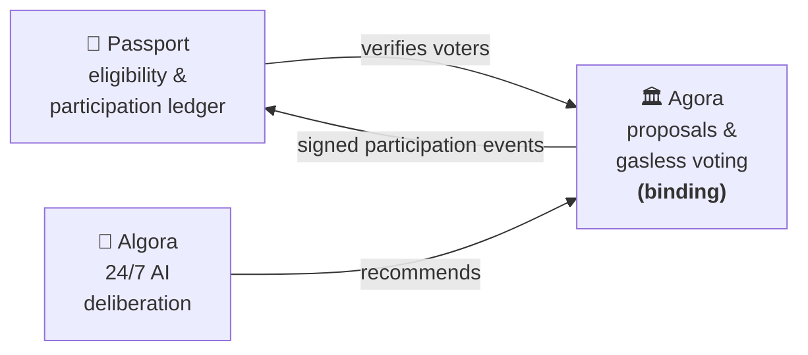

# Agora — Mossland DAO Governance

**Agora** is the decentralized governance app of the **Mossland (MOC)** ecosystem — where Mossland Coin holders **discuss**, **propose**, and **vote (gasless)** on the decisions that shape Mossland. It is the **binding decision layer and system of record** for Mossland DAO, upholding the values of openness, collaboration, and innovation at the heart of the community.

**🔗 Live app: [agora.moss.land](https://agora.moss.land)**

---

## Purpose

Agora is the democratic heart of Mossland DAO: a platform for members to **propose, discuss, and vote** on key decisions — fund allocation, project direction, community initiatives, and more. Every voice in the community is heard, and every MOC holder has the power to shape the future of Mossland.

## Where Agora sits — the Mossland governance stack

Mossland runs a **three-layer governance stack**, and Agora is the **binding decision layer**:

| Layer | What it does |
|---|---|
| **[Passport](https://passport.moss.land)** | Wallet verification, eligibility, and the participation ledger — signature-only, gas-free. |
| **Agora** *(this project)* | Formal, MOC-weighted proposals + **gasless off-chain voting**. **Binding.** |
| **[Algora](https://algora.moss.land)** | Experimental 24/7 AI deliberation that feeds recommendations into Agora's human vote — *"AI recommends, humans decide."* |

Agora emits **cryptographically signed participation events** to Passport and hosts the **AI proposal-brief** pipeline (absorbed from the sunset DAO-MAIT service) — together the **Governance Pack**.

## Key features

- **🗳️ Gasless voting** — cast **For / Against / Abstain** with a single wallet **signature** (EIP-712) — **no transaction, no gas**. Votes are weighted by each voter's MOC balance at the proposal's fixed **snapshot block** (Snapshot.org-style) and are **independently re-verifiable by anyone**.
- **📝 Proposals** — create rich-text proposals (off-chain, no gas), browse, and follow a transparent lifecycle: *In Review → Approved → Voting → Closed*.
- **💬 Forum** — topics with categories, comments, likes, reports, and view counts for open community discussion.
- **🔐 Wallet login (SIWE)** — one-click connect and a single **SIWE (EIP-4361)** signature; no passwords, no gas, no chain switching. Sessions ride on a secure HttpOnly cookie.
- **✨ AI proposal drafting** — generate proposal and topic drafts with an AI assistant while writing.
- **🧠 AI governance briefs** — neutral, extractive summaries of proposals generated by **Claude Opus 4.8** (with a Claude Sonnet → Gemini fallback), bound to the proposal's content hash so a brief always matches what it summarizes.
- **👤 Profiles** — MOC balance, voting history with explorer links, authored proposals/topics, and a selectable pixel-art character PFP.

## How voting works — gasless & verifiable

Voting is **off-chain and gasless**, in the style of [Snapshot](https://snapshot.org):

1. When an admin **approves** a proposal, the backend locks its **snapshot block** to the current Ethereum-mainnet block.
2. A voter signs an **EIP-712** vote (`proposalId`, `choice`, `snapshotBlock`) with one wallet prompt — no transaction, no gas.
3. The backend verifies the signature and derives the vote's weight from **`MOC.balanceOf(voter)` at the snapshot block** — so weight can't be forged or bought after the fact.
4. Each vote stores its signature and snapshot block, so **anyone can independently re-verify it** by recovering the signer and recomputing the balance at that block.

The governance token is **MOC**, an Ethereum-mainnet ERC-20 (`ERC20Votes` + `Permit`, CertiK-audited); the legacy Luniverse MOC was retired ahead of the mainnet migration. The earlier on-chain voting contract is no longer used for new votes — it is retained only to close pre-migration on-chain proposals, which still link out to their original transactions on a block explorer.

## Architecture & tech

A React single-page app on a static edge, a Node.js API, and Ethereum for token-weighted, verifiable voting.

| Area | Stack |
|---|---|
| **Frontend** | React 18 SPA · Vite · TypeScript · MUI · **ethers v6** · hosted on AWS S3 + CloudFront |
| **Backend** | Node.js 24 · Express · MongoDB (Atlas) · **ethers** · containerized on AWS |
| **Web3** | Ethereum mainnet · MOC ERC-20 (`ERC20Votes` + `Permit`) · **gasless EIP-712 voting** with on-chain snapshot weighting |
| **Auth** | **SIWE (EIP-4361)** wallet login · single-use nonce · HttpOnly-cookie sessions · no passwords |
| **AI** | **Anthropic Claude** (governance briefs) · Google **Gemini** (proposal drafting) |
| **Governance Pack** | **Ed25519**-signed participation events to Passport (durable outbox) · AI brief pipeline |
| **Abuse / analytics** | Google reCAPTCHA v3 (server-verified on votes) · Google Analytics |

## Repositories

Agora is built across the repositories below. The application source is kept **private** for security; the sections describe each component. If you'd like to contribute or collaborate, reach out at **[contact@moss.land](mailto:contact@moss.land)** for access.

| Repository | Role |
|---|---|
| **[Agora_frontend](https://github.com/MosslandCore/Agora_frontend)** | The MOC-holder-facing governance dApp — forum, proposals, gasless voting, profiles, plus role-gated admin tools going forward. Deployed at [agora.moss.land](https://agora.moss.land). |
| **[Agora_backend](https://github.com/MosslandCore/Agora_backend)** | The API service — auth, proposals, voting, forums, AI briefs, and the Passport (Governance Pack) integration. |
| **[Agora_frontend_dashboard](https://github.com/MosslandCore/Agora_frontend_dashboard)** _(archiving)_ | The standalone admin console — proposal management, moderation, and DAO operations. |

> ℹ️ **Admin tools are being consolidated into the main Agora frontend** as a role-gated, in-app admin area. Once that migration is complete, the standalone admin console and its **Agora_frontend_dashboard** repo will be **retired and archived** — there is no separate admin app or domain going forward.

We welcome contributors with expertise in front-end and back-end development, Web3 integration, or UI/UX design. Join us to shape the future of Mossland DAO!

## Documentation & related links

- 📚 **Codebase docs:** [Mossland Agora GitBook](https://ll0-3.gitbook.io/mossland-agora)
- 📓 **Product notes:** [Notion](https://abit.ly/bpx5go)
- 🎨 **Design:** [Figma](https://www.figma.com/file/3pLLZ0vr1jbVmMyHnai6cK/Mossland-Agora-project?type=design&node-id=14%3A152&mode=design&t=N7GjpNJdQEJJSt3O-1)
- 🗒️ **Foundation feedback:** [Docs](https://docs.google.com/document/d/1oYboOYPCcf-WMpDnOoPAojkih-mUeG-7Ujy0MDUwtRA/edit?pli=1)

---

<h2>📜 Development history &amp; milestone log (2024–2025)</h2>

Agora began development in January 2024. The log below records the original milestone scoping and weekly progress that led to the live product.

### Milestone #1 (2024/1/16 – 2024/2/15)

For Milestone #1, the focus was a comprehensive Product Requirement Document (PRD) covering:

1. Membership and Access Rights Management.
2. A DAO-based governance system implemented through Agora, including a robust Proposal and Voting System.
3. Considering integration with existing voting mechanisms in the Mossland Metaverse.
4. Forum-style communication channels within the DAO.

**Expected deliverables**

- A detailed user flow of the product, mapping out the interaction pathways for different user types.
- A fully designed high-fidelity (HiFi) design of the product interface, presented in Figma. This design encompasses all UI elements for a seamless, intuitive experience.

Research & development strategy:

- Engage in ideation sessions to brainstorm and refine concepts, ensuring solutions are innovative and user-centric.
- Conduct product dogfooding to internally test and iterate, gaining firsthand experience of the functionality and UI.
- Perform desk research to gather references and insights, analyzing existing solutions and best practices in similar domains.

#### Week 1 (1/16–1/23)
- Project kick off w/ mean — handover of the tasks to be done; shared [Milestone #1 scope](https://www.notion.so/Milestone-1-c0b7c11d93f04cb6b198f6b97cc36a1f?pvs=21).
- [x] Mossland Metaverse desk research
- [x] Read me 초안 작성하기 (draft README)

#### Week 2 (1/23–1/31)
- [x] 모스랜드에게 요청할 정보 정리해서 콜 요청하기 (compile info to request from Mossland, request a call)
- [x] 기획서 초안 작성 (draft planning doc) — PRD Draft (in progress)
- [x] 레퍼런스 리서치 (reference research)

#### Week 3 (1/31–2/6)
- [x] 유저 플로우별 상세 기획 (detailed planning per user flow)
- [x] 프로덕트 룩앤필/네이밍/로고 (product look & feel / naming / logo)
- [x] 디자인 — lofi 작업 시작 (start lofi design): 메인화면/유저 플로우, 디자인 컨셉
- [x] DAO 운영 관련 정책 update (DAO operations policy update)

#### Week 4 (2/7–2/16)
> 0207 추가 코멘트: 어드민 화면 요구사항 바탕으로 기능 명세 필요 → 디자인 플로우에 반영 예정. 현 lofi 기준 자잘한 수정사항 업데이트 진행 중. 웹앱 기준으로 디자인을 진행했으며, 모바일 화면 반응형 대응은 phase 2에서 project showcase 등 추가 화면 포함해 함께 대응 예정.

- [x] 어드민 스펙 update
- [x] lofi 수정사항 반영
- [x] Hifi 작업
- [x] 어드민 명세 추가 / 어드민 화면 업데이트
- [x] 1차 피드백 반영
- [x] 디자인 색 테마 변경 요청 대응
- [x] 어드민 topic 숨김(삭제) 처리 케이스 대응
- [x] 버튼 컴포넌트 디자인 변경 및 상태값 따라 분류

### Milestone #2 (2024/03/12 –, target release: 5.31)

**Expected deliverables**
- Milestone #1 product requirements, English version
- User onboarding guide content
- Milestone #1 developed product and admin

- Dev staffing: 1 FS dev full-time commit basis, 2MM+ PM follow-up

#### Week 1
- [x] Milestone #1 requirements delivered in English
- [x] Dev environment and base setup
- [x] Front-end work started

#### Week 2 (3/18–3/26)
- [x] Finalized front-end UI of the Agora admin dashboard; resolved outstanding UI/functionality questions
- [x] Deployed internal dev environment for admin dashboard QA
- [x] Shared admin dashboard code with the Mossland team via GitHub
- [x] Set up services for the Agora backend (email accounts, MongoDB, Luniverse blockchain node)

#### Week 3 (3/26–)
- [x] Admin dashboard front-end UI ready for initial review
- [x] Started back-end Web2 integration for the admin dashboard (CRUD endpoints for users, proposals, forums)
- [x] Started setup for the user-facing front-end — [Demo](https://mossland-app.vercel.app)
- [x] Loaded updated code to Mossland GitHub for admin UI and backend
- [x] Added admin's missing screens and policy complements

#### Week 4 (4/2–4/8)
- [x] Admin QA
- [x] Added front-end authentication on the admin UI (Metamask login gated to admins)
- [x] Started user-facing Agora UI + back-end Web2 integration
- [x] Started authentication / user-profile syncing on the user-facing Agora

#### Week 5 (4/8–4/15)
- [x] Added wallet signature on admin UI login (stronger auth)
- [x] Reported-topics empty-list button debugging
- [x] Rendering proposal votes
- [x] Rendering user activity
- [x] Login failure (unauthorised) → alert message
- [x] Require wallet signature when logging in
- [x] Table column search / sort

#### Week 6 (4/15–4/22)
- [x] UI styling + backend integration for the user-facing Agora
- [x] Added authentication handling for the user-facing Agora
- [x] Began Web3 integration (voting; which data is written to chain)
- [x] Integrated Mossland API calls for treasury data / user balances by wallet address
- [x] Second-round QA for the admin UI
- [x] Updated requirement docs with Figma comments

#### Week 7 (4/23–4/30)
- [x] Finalized UI styling for the user-facing Agora
- [x] Backend endpoint integration into the user-facing Agora
- [x] Web3 integration for voting and proposal creation on chain
- [x] Fixed minor QA tickets for the admin UI
- [x] UI mockup for proposal end-date extension in Figma

#### Week 8 (5/1–5/8)
- [x] QA on the user front-end
- [x] Decided detailed voting logic
- [x] User-guide content planning before design
- [x] Finalized UID / policy docs for submission
- [x] Finalized the user-facing Agora codebase
- [x] Web3 integration for voting and proposal creation on chain
- [x] Web3 registration flow accounting for existing Mossland users
- [x] Finalized authentication and permissions on all backend endpoints
- [x] Admin QA and front-end QA

#### Week 9 (5/8–5/15)
- [x] Front-end for admin and user-facing Agora complete
- [x] Web3 integration for voting and proposal creation on chain
- [x] Fetch user's MOC balance
- [x] Visualize voting results + passed metric
- [x] Admin QA and front-end QA

#### Week 10 (5/16–)
Complete:
- [x] Web3 integration for new proposals, voting, and close-voting complete
- [x] Fetch user's MOC balance — via a temporary 3rd-party API at the time
- [x] Voting-result UI complete
- [x] JWT authentication added to all endpoints requiring user login

In progress:
- [ ] Passed-proposals metric
- [ ] Final proposal result (fetch from contract once endDate is met)

To-do:
- [ ] Handover code to Mossland; deployment to the production environment + necessary ENV variables from Mossland side
- [ ] Transition the user's MOC balance API once it is ready from Mossland
- [ ] Admin QA
- [ ] Front-end QA

> Since this log, Agora shipped to production at [agora.moss.land](https://agora.moss.land), migrated to **gasless off-chain (EIP-712) voting** with on-chain MOC snapshot weighting, adopted **SIWE (EIP-4361)** login with HttpOnly-cookie sessions, added **AI proposal drafting and AI governance briefs**, and integrated with **Passport** via the Governance Pack.

**QA & planning references:** [QA list](https://docs.google.com/document/d/1Ljhx3PZBQmevXxMxnKzH8qUhySBRHOX8gZNX680LsYk/edit?usp=sharing) · [Milestone list](https://whimsical.com/mossland-dao-WeR1H6NQaWxLMroqPm4ygU)

